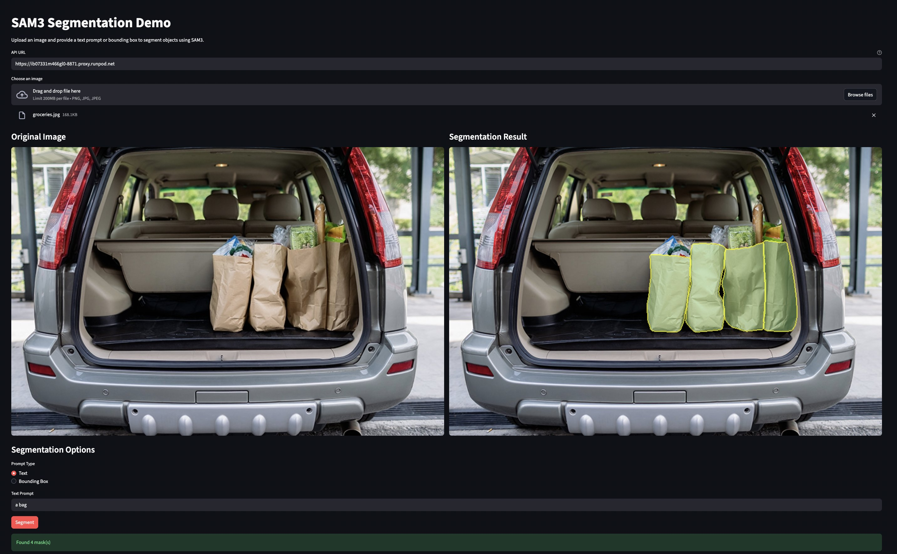

# SAM 3 Deploy API

Original repository: https://github.com/facebookresearch/sam3

## Main Features
- FastAPI-based API for SAM3 model deployment
- No CUDA / GPU requirement; works on CPU
- Easy setup with `uv` package manager
- CI tests with actual model inference and API endpoint checks

## Quick Start

```bash
# Install uv (if not already installed)
curl -LsSf https://astral.sh/uv/install.sh | sh

# Set your HuggingFace token (required for SAM3 model access)
export HF_TOKEN=your_huggingface_token_here

# Install dependencies
uv sync

# Start the API server
uv run uvicorn app.main:app --host 0.0.0.0 --port 8000
```

The API will be available at `http://localhost:8000`

## Streamlit Demo App



```bash
# In a separate terminal, start the Streamlit app
uv run streamlit run streamlit_app.py --server.address 0.0.0.0 --server.port 8501 --browser.gatherUsageStats false

# Or specify a custom API URL
uv run streamlit run streamlit_app.py --server.address 0.0.0.0 --server.port 8501 --browser.gatherUsageStats false -- --api-url http://your-api-server:8000
```

The demo app will open in your browser, allowing you to upload images and test segmentation with text prompts or bounding boxes.

## Documentation
- [Detailed API documentation](./app/README.md)